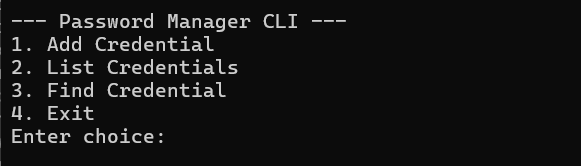
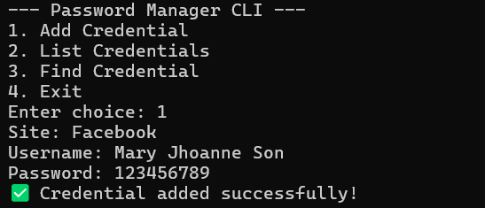
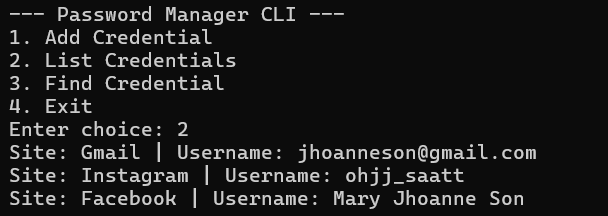
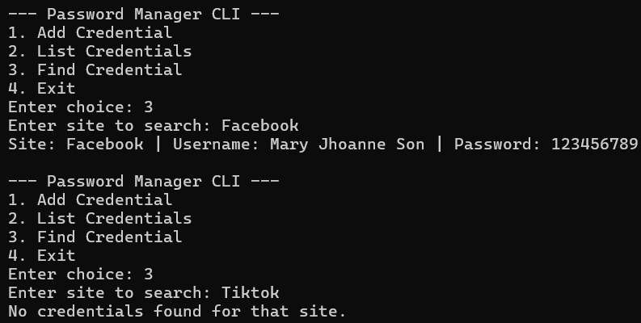

# CLI Password Manager – Final Project

## Description
A command-line password manager built in Python for secure storage and retrieval of credentials.  
It solves the problem of managing multiple accounts by allowing users to add, list, and search credentials, while ensuring passwords are encrypted and stored safely.

---

## Features
- Add new credentials (site, username, password)
- List all stored credentials
- Search credentials by site
- Secure storage using `cryptography.Fernet` encryption
- Persistent data storage in JSON format

---

## Sample CLI Usage

**Main Menu**


**Add Credential**


**List Credentials**


**Find Credential**


---

##  Project Structure

Son_MaryJhoanne_FinalProject/
├── README.md
├── requirements.txt
├── .gitignore
├── src/
│   ├── main.py
│   ├── models.py
│   └── storage.py
├── data/
│   ├── key.key
│   └── vault.json
└── screenshots/
    ├── main_menu.png
    ├── add_credential.png
    ├── list_credentials.png
    └── find_credential.png

---

## Demo Video

Watch the full walkthrough here:
https://youtu.be/Mff5d-AWdYw?si=_O5cQmocVOawzBKJ

---

## Installation / Setup

Clone the repository and install dependencies:

```bash
git clone https://github.com/jhoanneson/Son_MaryJhoanne_FinalProject.git
cd Son_MaryJhoanne_FinalProject
pip install -r requirements.txt

run the program from the root:
    python src/main.py